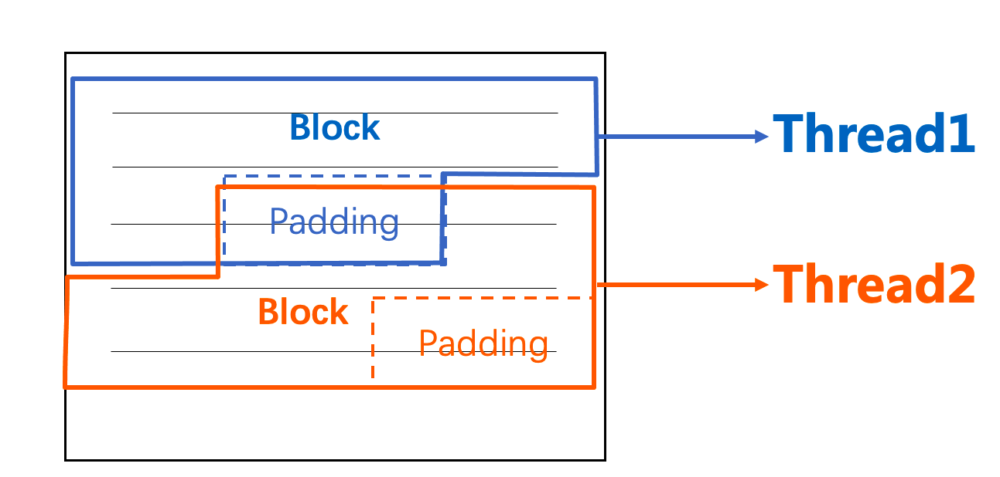
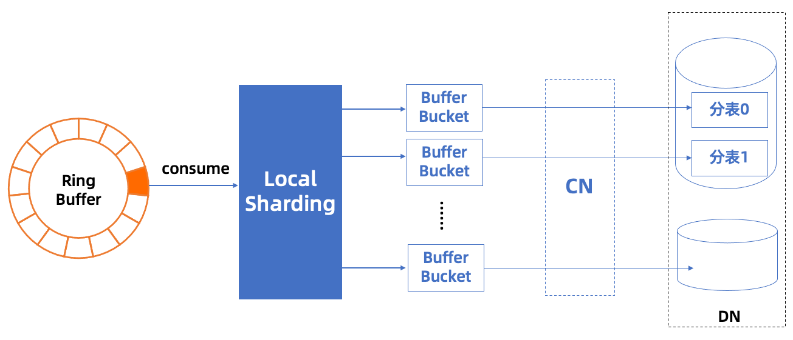

[](https://github.com/ApsaraDB/galaxysql/blob/main/LICENSE)
[](https://www.java.com/)

## Batch-Tool 介绍
Batch Tool工具是专为 PolarDB-X数据库提供数据导入导出服务的工具。
其结合分布式数据库特点实现一站式且高效地从文件导入、导出到文件以及跨库的离线数据迁移(MySQL / PolarDB-X 1.0 / PolarDB-X 2.0)等功能，
在此基础上，还支持基于文本文件批量更新、删除等功能 (实验特性)。

## 快速上手

### 参数介绍
命令行用法：

   ```
    usage: BatchTool [-batchsize <arg>] [-con <consumer count>] [-cs
       <charset>] [-D <database>] [-dir <directory>] [-f <from>] [-F
       <filenum>] [-fcon <use force consumer>] [-func] [-h <host>] [-H
       <history file name>] [-header] [-help] [-i] [-in] [-initSqls <arg>]
       [-L <line>] [-lastSep] [-lb] [-local] [-maxConn <arg>] [-maxWait
       <arg>] [-minConn <arg>] [-noesc] [-O <order by type>] [-o
       <operation>] [-OC <ordered column>] [-p <password>] [-P <port>]
       [-para] [-param <params>] [-pre <prefix>] [-pro <producer count>]
       [-quote <auto/force/none>] [-readsize <arg>] [-rfonly] [-ringsize
       <arg>] [-s <sep>] [-t <table>] [-tps <tps limit>] [-u <user>] [-v]
       [-w <where>]
 -batchsize,--batchSize <arg>                  Batch size of emitted
                                               tuples.
 -con,--consumer <consumer count>              Configure number of
                                               consumer threads.
 -cs,--charset <charset>                       Define charset of files.
 -D,--database <database>                      Database to use.
 -dir,--dir <directory>                        Directory path including
                                               files to import.
 -f,--from <from>                              Source file(s), separated
                                               by ; .
 -F,--filenum <filenum>                        Fixed number of exported
                                               files.
 -fcon,--force consumer <use force consumer>   Configure if allow force
                                               consumer parallelism.
 -func,--sqlfunc                               Use sql function to update.
 -h,--host <host>                              Connect to host.
 -H,--historyFile <history file name>          Configure of historyfile
                                               name.
 -header,--header                              Whether the header line is
                                               column names.
 -help,--help                                  Help message.
 -i,--ignoreandresume                          Flag of insert ignore and
                                               resume breakpoint.
 -in,--wherein                                 Using where ... in (...)
 -initSqls,--initSqls <arg>                    Connection init sqls.
 -L,--line <line>                              Max line limit of exported
                                               files.
 -lastSep,--withLastSep                        Whether line ends with
                                               separator.
 -lb,--loadbalance                             If using load balance.
 -local,--localmerge                           o local merge sort.
 -maxConn,--maxConnection <arg>                Max connection number
                                               limit.
 -maxWait,--connMaxWait <arg>                  Max wait time(ms) when
                                               getting a connection.
 -minConn,--minConnection <arg>                Mim connection number
                                               limit.
 -noesc,--noescape                             Don't escape values.
 -O,--orderby <order by type>                  asc or desc.
 -o,--operation <operation>                    Batch operation type:
                                               export / import / delete /
                                               update.
 -OC,--orderCol <ordered column>               col1;col2;col3.
 -p,--password <password>                      Password to use when
                                               connecting to server.
 -P,--port <port>                              Port number to use for
                                               connection.
 -para,--paraMerge                             Using parallel merge when
                                               doing order by export.
 -param,--connParam <params>                   Connection params
 -pre,--prefix <prefix>                        Export file name prefix.
 -pro,--producer <producer count>              Configure number of
                                               producer threads (export /
                                               import).
 -quote,--quoteMode <auto/force/none>          The mode of how field
                                               values are enclosed by
                                               double-quotes when
                                               exporting table. Default
                                               value is auto.
 -readsize,--readSize <arg>                    Read block size in MB.
 -rfonly,--rfonly                              Only read and process file,
                                               no sql execution.
 -ringsize,--ringBufferSize <arg>              Ring buffer size.
 -s,--sep <sep>                                Separator between fields
                                               (delimiter).
 -t,--table <table>                            Target table.
 -tps,--tpsLimit <tps limit>                   Configure of tps limit,
                                               default -1: no limit.
 -u,--user <user>                              User for login.
 -v,--version                                  Show version
 -w,--where <where>                            Where condition: col1>99
                                               AND col2<100 ...
   ```

命令主要分别为两个类别：
- 数据库连接配置，包括：
    - 基础连接信息：主机、端口、用户、密码等
    - 连接池配置：最大、最小连接数等
    - JDBC连接串参数
- 批处理配置，包括：
    - 批处理功能参数
        - 待操作表名、文件名列表
        - 分隔符、是否以分隔符结尾、字符集、引号转义等文本文件读取/写入相关参数
        - 文件数量、文件行数等导出配置
        - insert ingore、断点续传等导入配置
        - where、order by等sql条件
    - 批处理性能参数
        - 生产者、消费者并行度设置
        - ringBuffer缓冲区、批数量、读取文件块等大小设置
        - pre partition、local merge等
        - tps限流相关


### 场景示例
在无特殊说明的情况下，下文中导入导出默认指定的文件分隔符是`,` ，以及字符集是utf-8。
1. 假设需要导出 tpch 库下的 customer 表（分库分表模式）
   1. 默认导出，文件数等于表的分片数：
    ```shell
    java -jar batch-tool.jar -P 3306 -h 127.0.0.1 -u user_test -p 123456
    -D tpch -o export -t customer -s ,
    ```
   2. 导出为三个文件：
   ```shell
    java -jar batch-tool.jar -P 3306 -h 127.0.0.1 -u user_test -p 123456
    -D tpch -o export -t customer -s , -F 3
    ```
   3. 导出为多个文件，单个文件最大行数为 100000 行：
   ```shell
    java -jar batch-tool.jar -P 3306 -h 127.0.0.1 -u user_test -p 123456
    -D tpch -o export -t customer -s , -L 100000
    ```
   4. 指定 where 条件，默认导出：
   ```shell
    java -jar batch-tool.jar -P 3306 -h 127.0.0.1 -u user_test -p 123456
    -D tpch -o export -t customer -s , -w "c_nationkey=10"
    ```
   5. 如果文本字段包含分隔符，则指定引号模式，默认导出：
   ```shell
    java -jar batch-tool.jar -P 3306 -h 127.0.0.1 -u user_test -p 123456
    -D tpch -o export -t customer -s , -quote force
    ```
2. 假设需要将csv文件导入到 tpch 库下的 lineitem 表（分库分表模式），其中对应库表已创建好
   1. 指定单个文件导入：
   ```shell
    java -jar batch-tool.jar -P 3306 -h 127.0.0.1 -u user_test -p 123456
    -D tpch -o import -t customer -s , -f "./data/lineitem.tbl"
    ```
   2. 指定文件夹路径下所有文件导入：
    ```shell
    java -jar batch-tool.jar -P 3306 -h 127.0.0.1 -u user_test -p 123456
    -D tpch -o import -t customer -s , -dir "./data/lineitem/"
    ```
 
## ToDo 特性
- [x] 对接新分区表
- [ ] 调优实践
- [ ] 指定字段（包括顺序）的导入导出
- [ ] 简单的数据清洗，如trim尾部空格、日期时间格式等
- [ ] 基于SQL函数的数据清洗，以及AES加解密函数调用
- [ ] 可视化监控
- [x] 错误情况下的断点记录（精确到行/块）
- [x] 限流功能

## 整体设计
以数据导入场景为例，对于单机数据库从文件导入数据，提升性能的方法通常包括：(1)将多条 insert 语句合并为一条；(2)使用 PreparedStatement 的批量插入；(3)采用多进程/多线程进行导入。而对于分布式数据库而言，如果能结合 sharding 的特性，对插入数据在客户端预先在缓冲区根据 sharding key 进行划分、再将划分好的批数据发送至数据库，则不仅可以节省CN节点的计算开销，还可以降低 CN 节点对多个 DN 节点分布式调用的开销。

整体导入的流程如下：

1. 获取目标表的拓扑结构，包括划分键等元信息
2. 按行读取数据文件（目前支持 rfc4180 标准的csv格式，且分隔符可为任意字符串）
3. 根据(1)获取的信息计算对每行数据的分片，并放入对应的缓冲 bucket；
4. 当缓冲 bucket 满时，将该批数据拼入 insert 语句发送至数据库。

在按行读取文件的步骤中，通常认为顺序读取能带来最佳的性能，因为文件系统对于顺序读的行为可以进行流水线预读。
然而在导入中，读取文件的速率是远大于划分数据、发送到数据库并等待完成这个过程的，因此，为了充分利用文件I/O、网络I/O与CPU资源，项目实现采取了生产者-消费者模型，基于[Disruptor框架](https://lmax-exchange.github.io/disruptor/)进行开发。

其中，生产者线程按固定大小的块（为单次I/O的整数倍大小）读取文件，并根据读取到字节流中的换行符切分出一行行数据（如果有字符串型的字段类型，需要判断换行符是否在引号中）发送至生产者-消费者的缓冲区中，为了防止同一行数据被划分到两个不同的块中，此处每次按块读取需要多读一个固定大小的padding（取4KB），保证能读取到当前块最后一行的换行符，如下图所示。


此处文件读取虽然是多线程进行的，但内核I/O调度器在实际处理 I/O请求的过程中，可能会根据特定的调度算法合并邻近的 I/O请求，以减少磁盘的寻道时间，并且如果此处是多文件的多线程读取，则I/O的调度能带来更大的提升，所以整体来说多线程的分块读取文件能契合生产者-消费者模型，平衡I/O与CPU的资源利用，带来性能上的提升。

消费者线程则负责处理已划分成行的一批数据，负责放到对应的缓冲 bucket 中，最后拼接成sql语句发送至数据库（未来将对接 batch prepare 特性，做到更高性能的数据导入）。


实践中，在性能方面，可以根据实际运行环境的 I/O速率、CPU负载以及网络带宽等指标来调节生产者、消费者线程的比例与并发量，同时也可根据内存大小来设置 RingBuffer 缓冲区的长度；在功能方面，可以根据选项开关，指定文件的字符集、分隔符、是否开启预分片等模式。