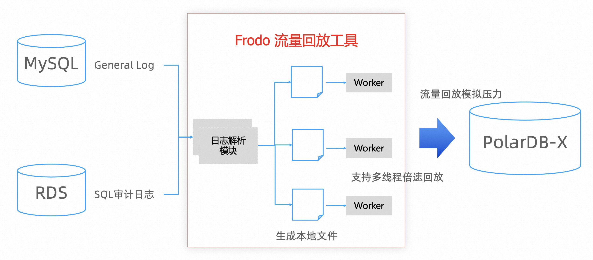
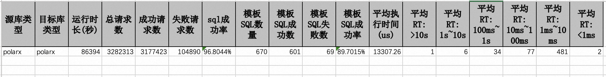
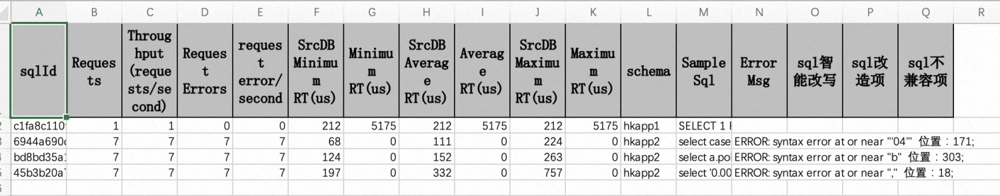

[](https://github.com/ApsaraDB/galaxysql/blob/main/LICENSE)
[](https://www.java.com/)

## Frodo是什么

frodo是一款数据库流量回放工具，主要用于解决数据库割接迁移过程中的性能评估，通过采集和模拟真实业务SQL的流量回放，可以更加精确的评估数据库迁移前后的性能对比

### Frodo 核心功能

1. SQL日志采集，采集真实源库的SQL流量，比如：支持自建mysql的general log或者网络流量旁路抓包、以及阿里云RDS的SQL日志等。
2. SQL流量回放，基于采集到的SQL流量模拟源库的业务行为，支持多线程技术进行SQL的倍速回放，更好的模拟数倍并发下的峰值流量。

工作原理：


## 编译打包
sh build.sh

## usage

### 1. 自建MySQL采集
MySQL sniffer是一个轻量的mysql SQL实时抓取工具，主要用于流量回放、从库预热、压力测试、SQL探查等场景。
目前支持两种SQL抓取能力：
1. 实时抓取mysql协议包，根据mysql X协议解析出对应的sql
2. 开启general log，通过监听general log和processlist抓取sql

参数解析：
```shell
--capture-method 获取SQL的方式：net_capture 抓包；general_log 从general log读取
--replay-to 回放场景：file：输出json格式的sql到文件；stdout：输出到控制台
--port 源库端口
--username 源库用户名
--password 源库密码
--network-device 抓包网卡，例如eth0  
--concurrency 并发数  
--time 运行时长，单位秒
--log-level 打印日志等级 info|debug|error
```
注意：
* 自建MySQL版本支持：mysql5.7、mysql8.0
* 工具需要和mysql机器部署在同一台机器上
* 网络抓包不支持ssl，需要在server端关闭ssl
* 网络抓包不支持blob流式写入场景

> 注意：如果指定--replay-to=file，文件默认输出到 logs/out.json，对应的out.json文件格式例子：
```sql
{"sqlId":"343630313032353439","schema":"test","session":3303722,"execTime":0,"convertSqlText":"SELECT c FROM sbtest1 WHERE id=430259","startTime":1656742693712000,"user":"root"}
{"sqlId":"343630313032353439","schema":"test","session":3303722,"execTime":0,"convertSqlText":"SELECT c FROM sbtest1 WHERE id=430259","startTime":1656742693712000,"user":"root"}
{"sqlId":"343630313032353439","schema":"test","session":3303722,"execTime":0,"convertSqlText":"SELECT c FROM sbtest1 WHERE id=430259","startTime":1656742693712000,"user":"root"}
```

#### 1.1 从自建MySQL采集分析general log
java  -jar mysqlsniffer.jar --capture-method=general_log  --replay-to=file --port=3306 --username=root --password=xxx  --concurrency=32 --time=60

#### 1.2 从自建MySQL通过抓包方式采集SQL流量
java  -jar mysqlsniffer.jar --capture-method=net_capture   --replay-to=file --port=3306 --username=root --password=abc123456 --network-device=eth0  --concurrency=32  --time=1000 --log-level=info

### 2. 阿里云RDS采集

云数据库一般无法直接登录数据库所在主机，可以依赖RDS的SQL审计日志。

SQL审计日志下载方式：

#### 1. 页面直接下载并选择json格式（该方式速度慢，适合小日志量下载）
   
直接下载的SQL审计日志无法直接用，需要使用 rds_audit_transfer.py 处理审计日志转换成frodo可识别的格式
```shell
python rds_audit_transfer.py -s xxxx.json -d out.json
```

#### 2. 使用slssniffer下载（该方式适合大日志量下载）

2.1 下载审计日志
```shell
#工具通过在sls创建consumer group的方式消费日志
#工具不会自动结束，需要持续tail -n 10 rds.json观察下载的日志最新的时间戳，然后手动kill进程
java -jar slssniffer-1.0.jar --endpoint=cn-hangzhou-intranet.log.aliyuncs.com \
    --project=drds-audit-cn-hangzhou-1073606203145207  --store=rds \
    --accesskey=xxxx --accesskeyid=xxx  \
    --from="2023-05-05 12:00:00" --sort-by-date \
    --log-type=rds-mysql --out=/root/rds.json --threads=4
```
工具对应的参数:
参数解释：
```shell
--endpoint	sls在该region下的api域名，建议选择内网域名
--project		sls project
--store		sls store
--accesskey	sk
--accesskeyid	ak
--from		从哪个时间点开始拉取日志 
--log-type	rds-mysql、drds、default，如果配置为default，那么会把原始日志全部拉下来。如果是rds-mysql或者rds，程序会自动过滤无用日志
--sort-by-date	是否按照日志里的时间添加排序时间戳，确保SQL日志顺序。sls本身不确保日志顺序性。如果log-type设置为default，会自动忽略该参数。
--out		日志存储的路径
--threads		消费者并发数量
--log-type	drds、rds-mysql，目前支持两种数据库产品sls日志的下载
--filter		根据sls字段进行过滤，格式：key=value，如果多个key，以逗号分割，例如：--filter="instance_id=xxxxx,instance_name=xxxx"
```
输出日志案例：
```shell
#第一列是SQL日志实际时间戳，第二列是回放所需要的json格式的sql日志。两列之间根据“-###@@@###-”分割
2023-05-05 13:17:45.458-###@@@###-{"schema":"sqlatest","session":"1275465","execTime":71,"startTime":"1683263865458440","convertSqlText":"select 'aaa'","user":"zkk_test"}
```

2.2 使用grep过滤想要回放的时间段的日志
```shell
#回放5月5号的日志
egrep '^2023-05-05'  /root/rds.json >rds.json

#回放5月5号10点-12点的日志
egrep '^2023-05-05 (10|11|12){1}'  /root/rds.json >rds.json
```

2.3 对日志进行排序，确保按照时间戳排序
> 注意：sls不保证日志顺序，必须根据日志里面的时间戳进行排序，保证日志顺序
```shell
#为提高sort效率，可配置内存、临时文件目录、并发等参数
sort -S 10240M -T /data --parallel=8 rds.json  > sort_rds.json
```

2.4 对日志进行截取
```shell
#该步骤跑完，即得到目标日志：out.json
awk -F '-###@@@###-' '{print $2}' sort_rds.json >out.json
```

### 3. 流量回放

回放脚本对应的参数描述：
```shell
--file 采集的sql文件
--source-db     源库类型 mysql、postgresql、polarx
--replay-to     回放到哪种数据库 mysql、polarx
--host          目标库ip
--port          目标库端口
--username=root 目标库用户名
--password      目标库密码
--database      目标库库名
--concurrency   并发数
--time=1000     执行时间,单位秒
--task          任务名
--schema-map    schema映射和过滤，例如schema1:schema2,schema2,schema3:schema2  只重放schema1、schema2、schema3 3个schema的sql，且schema1和schema3映射到schema2进行重放
--rate-factor   速度控制，1表示原速，0.5表2倍速度，0.1表示10倍速度
--circle        是否循环回放，如果开启循环回放，那边会忽略rate-factor参数，rate-factor置为0，以最大压力回放
--sql-timeout   设置sql超时时间，默认60，单位秒，建议设置合理sql-timeout，避免慢sql影响重放进度
--interval      运行时监控打印时间间隔，默认5，单位秒
--commit	    是否commit，默认frodo会手动开启事务进行回放，执行完一条SQL后会rollback，如果需要commit，可以打开该参数。
--filter        多选：ALL、DQL、DML;  ALL：所有sql；DQL：select；DML：update、insert、delete、replace、merge。参数默认值是ALL。只回放指定的SQL类型
--skip-dupli-error-sql  是否跳过已经报错过的相同SQL指纹的sql，默认关闭，如果打开，一定程度上能够提高重放速度
--disable-insert-to-replace 默认对polarx回放，会把insert转成replace，减少主键冲突的报错，但是replace可能会导致产生死锁。可以设置该参数关闭该特性。
--disable-transaction   是否关闭手动事务，如果关闭，那么SQL使用自动提交模式，--commit参数自动失效
```

#### 3.1 回放到 MySQL/RDS
```shell
java -Xms=2G -Xmx=4G -jar frodo.jar --file=/root/out.json \
    --source-db=mysql --replay-to=mysql --port=3306 --host=172.25.132.163 --username=root --password=123456 \
    --schema-map=test:test1,test2 --log-level=info --database=test \
    --concurrency=64 --time=1000 --task=task1 --rate-factor=1 
```

#### 3.2 回放到 PolarDB-X
```shell
java -Xms=2G -Xmx=4G -jar frodo.jar --file=/root/out.json -\
  -source-db=mysql --replay-to=polarx --port=3306 --host=172.25.132.163 --username=root --password=123456 \
  --schema-map=test:test1,test2 --log-level=info --database=test \
  --concurrency=64 --time=1000 --task=task1 --rate-factor=1 
```
#### 3.3 回放的结果报告
回放进程结束后，默认报告路径./run/#{task}/result.xlsx

3.3.1 概要报告

相关参数解读：
* SQL成功率：成功请求数/总请求数
* 模板SQL数量：去参数化后的SQL称为模板SQL
* 模板SQL成功率：模板SQL成功数/模板SQL数量
* 平均执行时间：SQL平均耗时
* 平均RT>10s：平均耗时超过10s的模板SQL的数量
* 平均RT1s\~10s：平均耗时在1s~10s之间的模板SQL的数量
* 平均RT100ms\~1ms：平均耗时在100ms~1s之间的模板SQL的数量
* 平均RT10ms\~100ms：平均耗时在10ms~100ms之间的模板SQL的数量
* 平均RT1ms\~1m0s：平均耗时在1ms~10ms之间的模板SQL的数量
* 平均RT<1ms：平均耗时小于1ms的模板SQL的数量

3.3.2 SQL详情

相关参数解读：
* sqlId：sql指纹
* requests：请求总数
* Throughput (requests/second)：每秒吞吐
* Request Errors：请求失败数
* request error/second：每秒请求失败数
* SrcDB Minimum RT(us)：原库最小耗时
* Minimum RT(us)：目标库最小耗时，包含网络耗时和jdbc处理耗时
* SrcDB Average RT(us)：原库平均耗时
* Average RT(us)：目标库平均耗时，包含网络耗时和jdbc处理耗时
* SrcDB Maximum RT(us)：原库最大耗时
* Maximum RT(us)：目标库最大耗时，包含网络耗时和jdbc处理耗时
* schema：目标库回放schema
* Sample sql：sql示例
* Error Msg：报错信息概要
